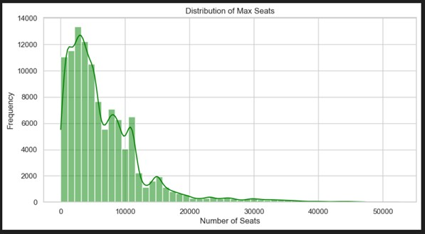
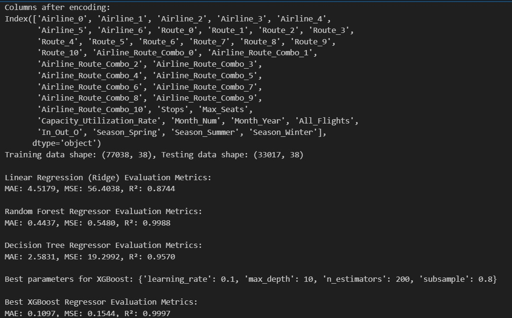

# Flight Number Prediction using Regression Models

## 1. Project Overview
This project focuses on building and evaluating machine learning models to predict the total number of flights (`All_Flights`) based on various factors from a comprehensive dataset. The goal is to demonstrate a comprehensive data science workflow, encompassing data cleaning, exploratory data analysis (EDA), feature engineering, and predictive modelling using multiple regression algorithms.

## 2. Dataset
The analysis is performed on a dataset containing detailed flight information. The key columns include:
* **`Month`**: The month and year of the flight.
* **`Australian_City`**: The Australian departure or arrival city.
* **`International_City`**: The international departure or arrival city.
* **`Airline`**: The airline operating the flight.
* **`Route`**: The flight route.
* **`All_Flights`**: The total number of flights (the target variable to be predicted).
* **`Max_Seats`**: The maximum number of seats available.

## 3. Methodology
The following steps were taken to build the predictive models:

### Data Cleaning and Pre-processing
* Handled categorical and numerical data.
* Converted the `Month` column to a datetime format for time-series analysis.

### Exploratory Data Analysis (EDA)
Exploratory data analysis was performed to understand the dataset's characteristics and identify key patterns and relationships.

#### Trend of Flights Over Time
The first step was to analyse the trend of all flights over the years, which showed the impact of external events like the COVID-19 pandemic on flight volume.

#### Distribution of Maximum Seats
The distribution of the `Max_Seats` feature was visualised to understand the passenger capacity across different flights.

#### Correlation Heatmap
A correlation heatmap was used to visualise the relationships between numerical features in the dataset.

#### Scatter Plot: Flights vs. Seats
A scatter plot was used to explore the relationship between the total number of flights and the maximum number of seats, which showed a strong positive correlation.

#### Top 10 Airlines by Flight Volume
The top 10 airlines with the highest number of flights were identified to understand major contributors to flight traffic.

### Feature Engineering
* Categorical variables were one-hot encoded.
* Numerical data were standardised, and feature selection was performed.

### Model Selection and Training
Four different regression models were trained and evaluated to find the best performer. The models included:
* **Linear Regression**
* **Decision Tree Regressor**
* **Random Forest Regressor**
* **XGBoost Regressor**

## 4. Results
The models were evaluated based on their accuracy in predicting flight numbers using the R-squared ($R^2$) score. The summary of the results is shown below.

The **XGBoost** and **Random Forest** models demonstrated superior performance, accurately capturing the complex patterns in the dataset.

## 5. How to Run
To replicate the analysis, you will need the following files:
* `Assignment 2.ipynb` (Jupyter Notebook with the code)
* `Flights.csv` (The dataset)

You can run the notebook by following these steps:
1.  Clone this repository to your local machine.
2.  Ensure you have Python installed with the necessary libraries listed in the `requirements.txt` file.
3.  Open the `Assignment 2.ipynb` file in a Jupyter environment.
4.  Run all cells in the notebook sequentially.

